# README for Simplified Installation with PyCharm on a Mac
[Back to root README](../README.md)

Caveat: Stuff changes --  Operating Systems, IDEs, tools, packages, dependencies, and languages.  We do our best to keep up with change, but 
there may be outdated information on this change.  Tell us if you run into troubles.

## Installing WeVoteServer: On a new Mac
These instructions are for a new Mac, or at least a Mac that hasn't been used for 
Python development before.  Some of these tools may already be setup on your Mac, but
reinstalling them causes no harm, skip the parts you are sure you already have.

If you have never installed Postgres on your Mac (or don't mind fully deleting any Postgres that you have already 
installed on your Mac), these instructions should take an hour or so to complete. 

1. Install the Chrome browser for Mac

1. Open the Mac "App Store" app, and download the current version of Apple's Xcode, which includes "c" language compilers 
    and native git integration. This download also includes Apple's Xcode IDE for macOS and iOS native development.

    **Note: Xcode requires about 30 GB of disk space, if you don't have much that room on your Mac, it is sufficient 
    to download only the "Xcode Command Line Tools", but you need to sign up as an Apple developer to do that.  Download (the latest version of) "Command Line Tools for Xcode 13" at 
    [https://developer.apple.com/download/more/](https://developer.apple.com/download/more/)  These tools only require 185 MB 
    of disk space.  If you choose to download only the tools, skip on to Step 6.**
    
    If you have enough disk space, it is much easier to just install all of Xcode (including the full Xcode IDE) from 
    the app store:
    <div style="max-width:500px">

    
    </div>

1. Start xcode (you can find it with Spotlight, or in the Application folder)

    <div style="max-width:500px">
   
    
    </div>

1. When prompted, download the "Additional Components" (the Command Line Tools).  This takes a many minutes to complete.

1. When you get to "Welcome to Xcode", quit out of the app. (For the WeVoteServer, we only need the command line tools that 
come with Xcode.)

   <div style="max-width:500px">
   
   
   </div>

1. Navigate in Chrome to [GitHub](https://GitHub.com).  Create a personal account if you don't already have one.
 
1. Within the GitHub site, navigate to [https://GitHub.com/wevote/WeVoteServer](https://GitHub.com/wevote/WeVoteServer). 
    Create a fork of wevote/WeVoteServer.git by selecting the "Fork" button (in the upper right of screen).
    
   <div style="max-width:800px">
   
   
   </div>

1. Download and install the Community version of PyCharm, it's free!
    [https://www.jetbrains.com/pycharm/download/#section=mac](https://www.jetbrains.com/pycharm/download/#section=mac)

1. StartPyCharm, and press the 'Get from VCS' button.

   <div style="max-width:800px">
   
   
   </div>

1. Clone your fork of the git repository, by copying the URL to the repository into the URL filed, then press the Clone button.
_What this means in english is that you have created a copy in GitHub of the WeVoteServer codebase, and cloning it downloads
a copy of your copy to your Mac._  At this instant, the 'develop' branch of wevote/WeVoteServer matches
   your branch (in this example) SailingSteve/WeVoteServer and also matches the code on your Mac.

   <div style="max-width:800px">
   
   
   </div>

1. The PyCharm IDE appears in 'Dracula' mode, with the repository loaded to your disk, and ready to edit.

   <div style="max-width:800px">
   
   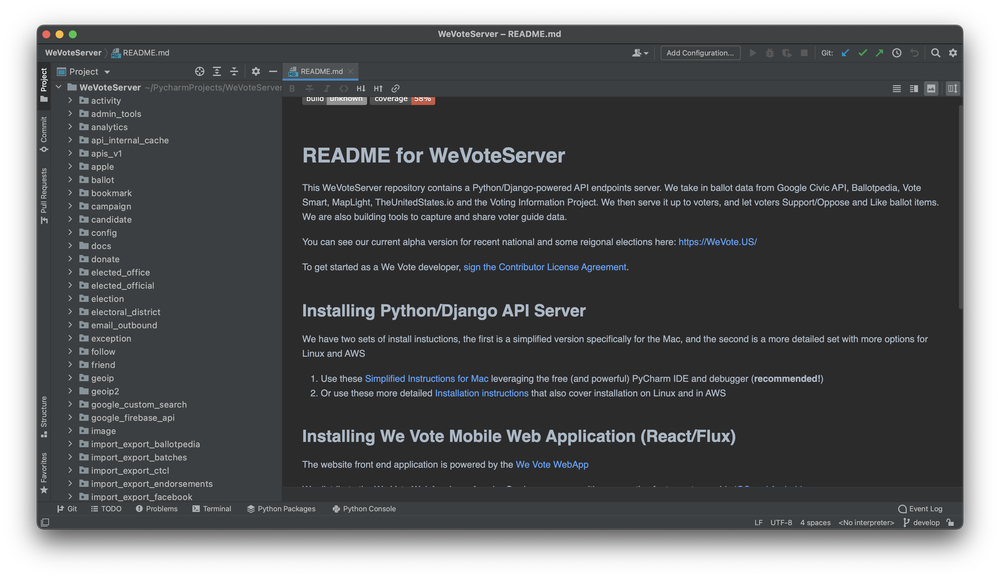
   </div>
1. If you like 'Dracula' mode, you can skip this step.  Open PyCharm/Preferences and press the
'Sync with OS' button to match the display mode of your Mac.  
   
   <div style="max-width:800px">
 
   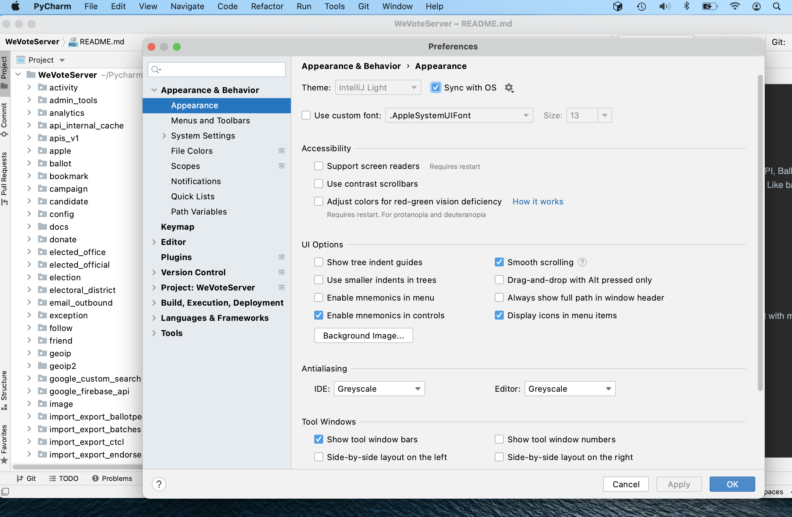
   </div>

1. In PyCharm/Preferences/Plugins enable the Markdown and IdeaVim tools (this takes a while).  
Feel free to add any other PyCharm tools that you would like!  When done press 'Ok', and the IDE will reboot.

   <div style="max-width:700px">
   
    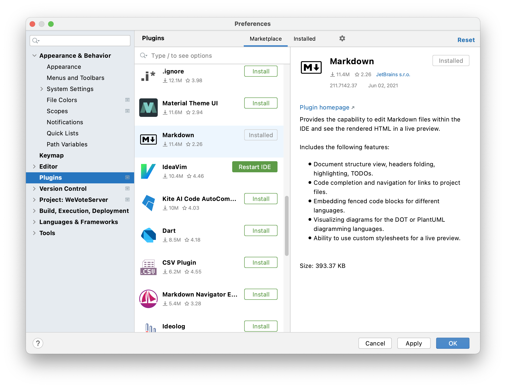
   </div>

1. If the Apple top menu, shows "Git" skip this step.  If it says "VCS", the follow this step to configure Git

    <div style="width:500px">

     
    </div>
   
   Select 'Git' on the VCS meu, and press Ok.
   <div style="height: 20px"/>
   
   <div style="max-width:800px">
   
   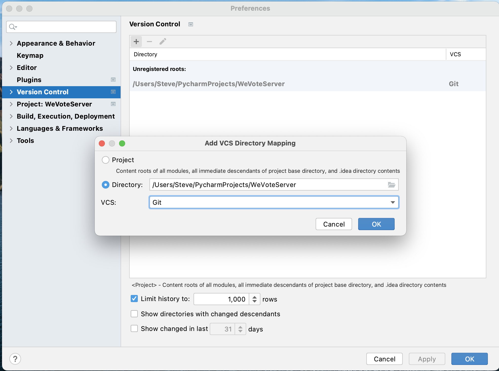
    </div>

1. In PyCharm set your git remotes. Navigate to the Git/'Manage Remotes...' dialog

   

   The WeVoteServer project defines upstream and origin differently than most projects.

   Click the edit (pencil) icon, and change the word origin to upstream. This is how it looks after the change.
   
   

1. Then add a remote for your private branch by pressing the '+' button on the Git Remotes dialog.  Add the url for your
    fork of the WeVoteServer project origin (copy the url from the GitHub website). In this example, the developer 
    is "SailingSteve".

    <div style="height: 20px"/>
    
   
   <div style="height: 20px"/>
      
1.  When the cloning is complete, it will look something like this.
    
    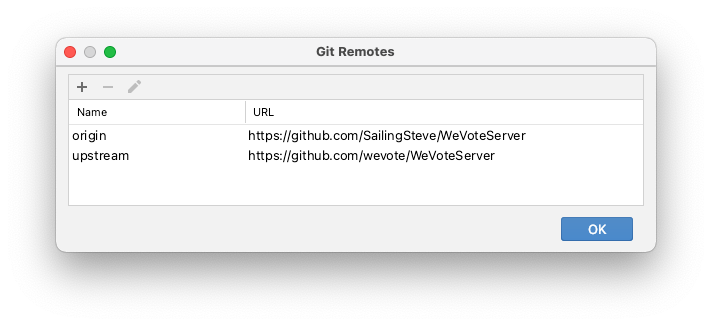
    Press Ok to close the dialog
    <div style="height: 10px"/>

1. In PyCharm copy `environment_variables-template.json` to `environment_variables.json`

    

    Right click on `environment_variables-template.json` and select 'Copy', then right click paste on the `config` 
    directory and select 'Paste' in the pop-up, and then in the copy dialog that open up, and change the "new name:" to 
    `environment_variables.json`
    
    If you skip this step, in a much later step, when you run "makemigrations", it will fail with an 
    'Unable to set the SECRET_KEY variable from "os.environ" or JSON file' error.
    
    **There are a number of secret values in `environment_variables.json` that are not in source control,
    you will need to check in with Dale, as you find that you need them.**

1. In PyCharm, open the Terminal window and accept use of the z shell (if you love some other shell, feel free to skip this step)

   <div style="max-width:900px">
   
    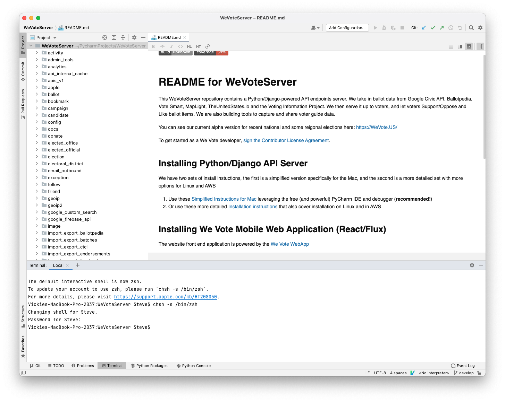
    </div>
    The terminal opens up with the project root directory set as the pwd (which is handy).
    <div style="height: 10px"/>

1. In the PyCharm terminal window download [Homebrew]( https://brew.sh/) ("the missing package manager for macOS") by entering
the following command:
    
    ``` 
    $ /bin/bash -c "$(curl -fsSL https://raw.GitHubusercontent.com/Homebrew/install/master/install.sh)"
    ``` 

    This loads and runs a Ruby script (Ruby comes pre-installed in macOS), and Ruby uses curl (also pre-loaded) to pull the file 
   into the bash (terminal) command shell for execution.  This Ruby script also internally uses 'sudo' which temporarily gives 
    the script root privileges to install software, so you will need to know an admin password for your Mac.  
    <div style="height: 10px"/>
    This script can take a few minutes to complete.
    <div style="height: 10px"/>

1. Install the latest version of Python

    ```
    $ brew install python
    ```
    If an older version of Python has been installed, and the installation fails, you will see the following error:
    ```
    Error: python@3.9 3.9.1_1 is already installed
    To upgrade to 3.9.5, run:
      brew upgrade python@3.9
    Steve@Vickies-MacBook-Pro-2037 WeVoteServer % 
    ```
     In which case you run `brew upgrade python@3.9`, then finally export the path as shown below.
    ```
    $ export PATH="/usr/local/opt/python/libexec/bin:$PATH"
    ```
1. Test that the newly installed Python is in the path. macOS comes with Python 2 preinstalled,
if the reported version is 2, then add the newly loaded python to the path with the export command,
and confirm that the default python is now version 3.9 or later.  (Version 3.6 has problems with   
macOS Big Sur or later)

    ```
    Steve@Vickies-MacBook-Pro-2037 WeVoteServer % python --version
    Python 2.7.16
    Steve@Vickies-MacBook-Pro-2037 WeVoteServer % export PATH="/usr/local/opt/python/libexec/bin:$PATH"
    Steve@Vickies-MacBook-Pro-2037 WeVoteServer % python --version                                     
    Python 3.9.5
    Steve@Vickies-MacBook-Pro-2037 WeVoteServer % 
    ```   

1. Create a log directory

   List a file to find the owner and group, in this case Steve and staff, then use sudo to force the creation of a
   log directory.  Then uses sudo to change the ownership of that directory to yourself.
    ```
    (venv) Steve@Vickies-MacBook-Pro-2037 WeVoteServer % ls -la requirements.txt
    -rwxr-xr-x  1 Steve  staff  1755 Jun 17 10:06 requirements.txt
    (venv) Steve@Vickies-MacBook-Pro-2037 WeVoteServer % 
    (venv) Steve@Vickies-MacBook-Pro-2037 WeVoteServer % sudo mkdir /var/log/wevote
    (venv) Steve@Vickies-MacBook-Pro-2037 WeVoteServer % sudo chown Steve:staff  /var/log/wevote
    ```

1. Set up a Virtual Environment with the new Python Interpreter.  
Navigate to: PyCharm/Preferences/Project: WeVoteServer/Python Interpreter.

   <div style="max-width:800px">
   
   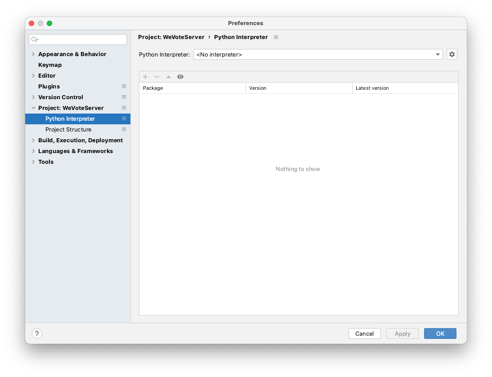
   </div>

1. Click the Gear icon, then select "Add".  PyCharm will detect the latest interpreter from the PATH environment variable, 
   and pre-populate the dialog.  Check the two checkboxes `Inherit global site-packages` and `make available to all projects`.
   
   <div style="max-width:800px">
   
   
   </div>

   Confirm that we are using the Python version that you just downloaded, and it knows the location for pip, setuptools, and wheel (3 python utilities).
   Then press Ok.
   
   <div style="max-width:800px">
   
   
   </div>

1. Confirm that the new virtual environment is in effect, by closing all open Terminal windows within
PyCharm and opening a new one.

   <div style="max-width:700px">
  
   
   </div>
    <div style="height: 10px"/>
   If you see `(venv)` at the beginning of the command line, all is well.
    <div style="height: 16px"/>
   
1. Install OpenSSL, the pyopenssl and https clients:
 
    `(WeVoteServerPy3.7) $ brew install openssl`
    <div style="height: 10px"/>
    If it is already installed, no worries!
    <div style="height: 10px"/>

1.  Link libssl and libcrypto so that pip can find them:
    ```
    $ ln -s /usr/local/opt/openssl/lib/libcrypto.dylib /usr/local/lib/libcrypto.dylib
    $ ln -s /usr/local/opt/openssl/lib/libssl.dylib /usr/local/lib/libssl.dylib
    ```
1. Install libmagic

    `(WeVoteServerPy3.7) $ brew install libmagic`
    <div style="height: 10px"/>

1. Install all the other Python packages required by the WeVoteServer project (there are a lot of them!)
    <div style="height: 10px"/>

    `(WeVoteServer3.7) $ pip3 install -r requirements.txt`
    <div style="height: 10px"/>

    This is a big operation that loads a number of wheels definitions and then compiles them.   Wheels are
    linux/macOS binary libraries based on c language packages and compiled with gcc.  Using binary wheels instead of
    interpreted Python code speeds up execution.  (Some Wheel objects are downloaded as binary objects, instead of locally 
    compiled, and those wheels are specifically pre-compiled for the current macOS version).
    <div style="height: 10px"/>
    If this install succeeds with no missing libraries, or other compiler errors, we are
    most of the way to done.  If this install fails, please ask for help.


## Install and set up PostgreSQL and pgAdmin4

1. If you are sure that Postgres has not already been installed, and is not currently running on this Mac, you can skip
this step.  To see if postgres is already running, check with lsof in a terminal window `lsof -i -P | grep -i "listen" | grep postgres`:

    ```
    (venv) $ lsof -i -P | grep -i "listen" | grep postgres
    postgres  13254 admin    5u  IPv6 0x35032d9cf207f247      0t0  TCP localhost:5432 (LISTEN)
    postgres  13254 admin    6u  IPv4 0x35032d9d01cd2647      0t0  TCP localhost:5432 (LISTEN)
    (venv) $
    ```  
 
     If the output shows postgres has already been installed and is listening on port 5432.  Stop and fix this,  
    otherwise you would install a second postgres instance running on port 5433, and the result would be hours of "port 
    assignment" mess to clean up. 
    <div style="height: 10px"/>
   
    **If that lsof line returns nothing, then you don't currently have postgres running, and you can continue on to the next step.**
    <div style="height: 10px"/>
    or
    <div style="height: 10px"/>
   
    **If you don't mind fully deleting any Postgres database data that you have already installed, then delete the existing Postgres now.  Postgres
    can be setup in many ways, so there are no instructions here on how to delete Postgres. You can start with running `which postgres`
    in a terminal and going to that directory and deleting the instance or the symbolic links to the instance, then it is
    probably easiest to reboot your Mac to see if Postgres starts up again.**
    
    or
    
    **If you have to keep some data that is already stored in a Postgres instance that is installed on your Mac that you absolutely need to 
    retain, then you must take the time to upgrade that Postgres to the latest version.**  This is a ton of work, and is rarely needed.
    <div style="height: 10px"/>
   
1. Install PostgreSQL by running the following command:

    `(venv) $ brew install postgresql`

1. Start PostgreSQL (this is actually instructing the macOS [launchd](https://en.wikipedia.org/wiki/Launchd) to start 
    Postgres every time you start your Mac):

    `(venv) $ brew services start postgresql`

1. Create a default database, and a default user, and then log into the 'psql' PostgreSQL command interpreter:

    ```
    (venv) $ createdb
    (venv) $ createuser -s postgres
    (venv) $ psql
    psql (11.1)
    Type "help" for help.
    
    admin=# 
    ```

    The `psql` command starts a PostgresSQL command session which is started in the bash terminal window, within this 
    PostgresSQL command session type the following Postgres commands... ("admin" is just an example password, use whatever
    password you would like to go with your postgres role name.)

    ```
    admin=# ALTER USER postgres WITH PASSWORD 'admin';
    ALTER ROLE
    admin=# \du
                                       List of roles
     Role name |                         Attributes                         | Member of 
    -----------+------------------------------------------------------------+-----------
     admin     | Superuser, Create role, Create DB, Replication, Bypass RLS | {}
     postgres  | Superuser, Create role, Create DB                          | {}
    
    admin-# \q
    (venv) $
    ```

    That `\du` command confirms that we have a 'postgres' role.  The `\q` command quits psql.
    <div style="height: 10px"/>

 1. Now you are ready to install pgAdmin4 (a powerful WYSIWYG database administration tool that is open source 
 and built by volunteers (Many thanks to the pgAdmin team!)). Run:
    <div style="height: 10px"/>

    `(venv) $ brew install --cask pgadmin4`
    <div style="height: 16px"/>
    
    This can take a few minutes to complete.  When `brew install --cask pgadmin4` finishes, it prints out `Moving App 'pgAdmin 4.app' to '/Applications/pgAdmin 4.app'.`
    <div style="height: 10px"/>
    The latest pgAdmin4 has a webapp architecture, where the app you start from the Application folder is actually a 
    single purpose web server, and the UI for the app appears in Chrome as a local website.
    <div style="height: 10px"/>

1. Use Spotlight to find and launch the pgAdmin4 app.  Once launched, the pgAdmin4 webapp will display in a new tab within Chrome.
    On that new tab, Right-click on "Servers" 
    and choose "Create > Server"
    <div style="max-width:800px">

    
   </div>
    <div style="height: 10px"/>

1. On the first tab of the "Create - Server" dialog, add into the Name field: WeVoteServer
    <div style="max-width:800px">

    
   </div>
    <div style="height: 10px"/>

1. Switch to "Connection" tab, and enter the following information:
   * Host name: localhost
   * Port: 5432
   * Maintenance database: postgres
   * User name: postgres
   * Password: <your private password for the postgres user>
   * Save password: checked
    <div style="height: 16px"/>

    
    <div style="height: 10px"/>

1. Press Save
    <div style="height: 10px"/>

1. Create the Database by right-clicking on Databases in the server tree on the left. Then select  
   Create > Database on the cascading menu
   <div style="max-width:800px">

   
    </div>

1. Name the new database WeVoteServerDB and press save.

   <div style="max-width:800px">

   
   </div>
   
   <!-- owner is 'admin' in the picture, but defaulted to 'postgres' in my install -->

## Initialize an empty WeVoteServerDB

1. Create an empty log file on your computer to match the one expected by the app as configured in the environment_variables.json file:

    ```
    (venv) $ sudo mkdir /var/log/wevote/
    (venv) $ sudo touch /var/log/wevote/wevoteserver.log
    (venv) $ sudo chmod -R 0777 /var/log/wevote/
    ```

    As configured by default in our configuration code from GitHub, only errors get written to the log.
    Logging has five levels: CRITICAL, ERROR, INFO, WARN, DEBUG.
    It works as a hierarchy (i.e., INFO picks up all messages logged as INFO, ERROR and CRITICAL), and when adding logging 
    code we specify the level assigned to each message. You can change this to info items by changing the LOG_FILE_LEVEL variable 
    in the WeVoteServer/config/environment_variables.json file to "INFO".
    <div style="height: 10px"/>
    
    **Note:** Logging slows down Python app execution in production, so only use it for very important or very rarely used code or 
    code that is only used by the admin pages by developers.  You can also write your log files at the DEBUG level, and then they
    won't execute on the production server.
    <div style="height: 10px"/>

1. "Migrations are Django’s way of propagating changes you make to your software models into your local postgres database schema."
   Everytime you create a table, change a field name or description, you are changing the model, and those changes need to 
   be incorporated into the on-disk database schema.
    <div style="height: 10px"/>
   Run 'makemigrations' to gather all the schema information that is needed to initialize the WeVoteServer database:

    ```
    (venv) $ python manage.py makemigrations
    (venv) $ python manage.py makemigrations wevote_settings
    ```
     (January 28, 2019:  that second makemigrations for the wevote_settings table should not be necessary, but as of today, 
     it is necessary.  That second makemigrations line will be harmless, if it becomes unnecessary at some point.)
    <div style="height: 10px"/>
   
1. Run 'migrate'.  Django "migrate is responsible for applying and un-applying migrations."

    `(venv) $ python manage.py migrate`
 
## Set up a PyCharm run configuration

1. Set up a run configuration (this will enable the green play button, and the green debug button on the top line)    
   <div style="height: 10px"/>
   Click in the the "Add Configuration..." field that is to the left of the play button.
    <div style="max-width:900px">

   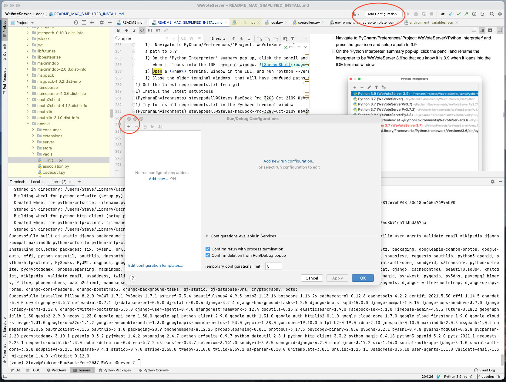
    </div>
   
   Press the '+' sign in the upper-left corner of the dialog.  
   <div style="height: 10px"/>
   
   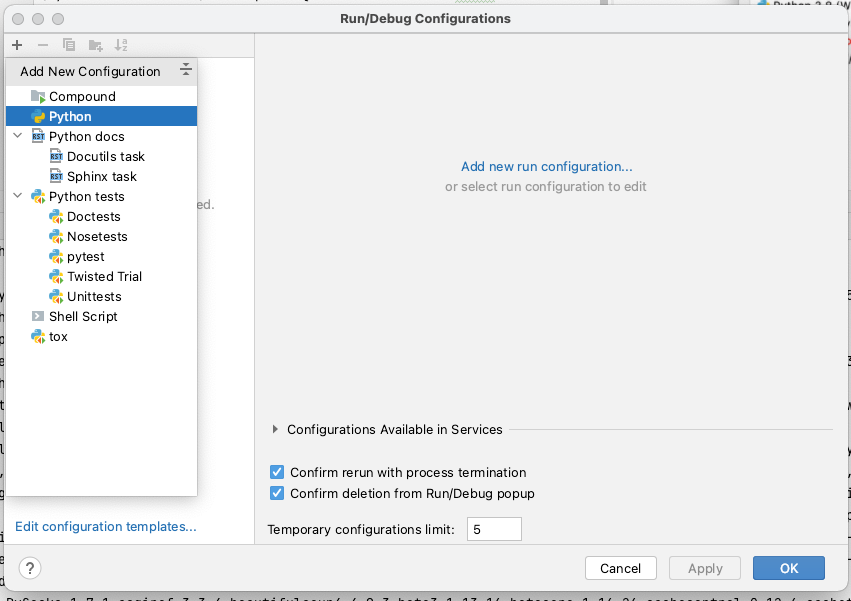
   <div style="height: 10px"/>
   Then select Python,
    and click 'Add new run configuration...'
       
   For "Script path", add the path 
   to your `manage.py` file that will be in your project root directory, and for "Parameters" add `runserver` as the command.  
   Then press "Ok".
   
    
    
1.  Run the app:  Press the triangular Run button on the top line of the ide, and note that a run window opens at the bottom of the IDE,
    on the same line as the "Terminal" tab.
    <div style="height: 10px"/>
    As API calls are made to the server, the http requests will be displayed in 
    this runtime log.
    <div style="height: 10px"/>
    Python print commands, only send their output to this log.  Python logger commands send the output
    to both this runtime log, and the log file that we created a few steps back.  On the production servers in AWS, these 
    log lines can be searched using Splunk (ask Dale for Splunk access if you could use it.)
    <div style="height: 10px"/>
1.  Now, with the server still running, open a terminal window, and create a simple default user (a voter), so you can log in to the 
    management pages of the WeVoteServer.
    <div style="height: 10px"/>
    At We Vote, "voters" are what we call end users.  This new "voter" will have all the 
    rights that you (as a developer) need to login to 
    [http://localhost:8000/admin/](http://localhost:8000/admin/) and start synchronizing data (downloading ballot and issue 
    data from the master server in the cloud, to your local server).

   <div style="height: 10px"/>
   The usage is:  python manage.py create_dev_user first_name last_name email password

    ```
    (WeVoteServer3.7) admin$ python manage.py create_dev_user Samuel Adams samuel@adams.com ale 
    Creating developer first name=Samuel, last name=Adams, email=samuel@adams.com
    End of create_dev_user
    (WeVoteServer3.7) admin$ 
    ```
    
1.  Navigate to [http://localhost:8000/admin/](http://localhost:8000/admin/) and sign in with your new username/password.    
  
1.  The local instance of the WeVoteServer is now setup and running (although there is no election 
    data stored in your Postgres instance, for it to serve to clients at this point).

## import some ballot data from the live production API Server

   
**This page of instructions has covered steps 1 through 5 of the multi-page instructions, so now you can skip to step 6 to 
load some ballot data.**

Step 6:  [Set up Initial Data](README_API_INSTALL_SETUP_DATA.md)

[Back to root README](../README.md)

<div style="height: 80px"/>

-----------
     
## June 14, 2021, Changes that were necessary for macOS Big Sur

**This is not list of sequential steps to complete a re-installation.  This list describes a few events
that happened, with what I did to work around them**

*  macOS BigSur (11.3.1) was complaining about Python 3.6.1, and the app would not work, so
   I upgraded Python to the latest 3.9.1

   <div style="max-width:500px">
   
   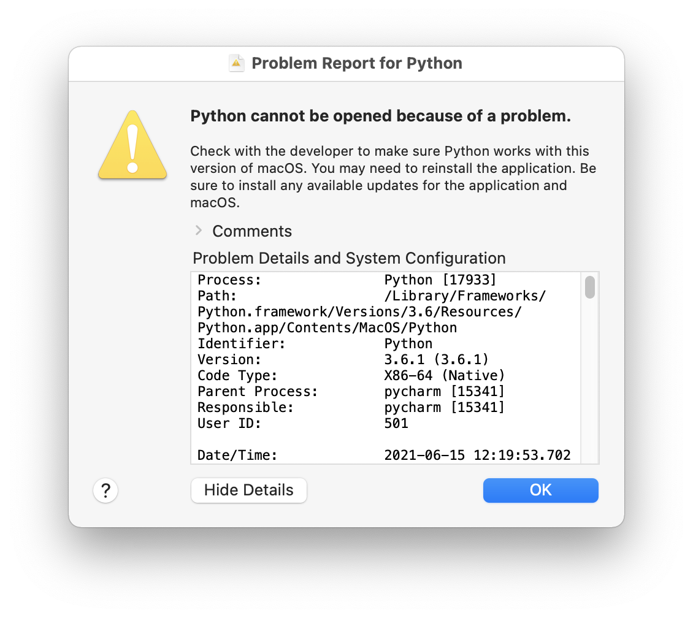
   </div>

*  Uninstall Python (which was previously installed with Homebrew)
   ```
   (venv) stevepodell@Steves-MacBook-Pro-32GB-Oct-2109 pkgconfig % brew uninstall --ignore-dependencies python3
   ```
   
*  Install the latest Python
    ```
    (venv) stevepodell@Steves-MacBook-Pro-32GB-Oct-2109 pkgconfig % brew install python3
   ```
   
*  Brew (re)link the python
    ```
    stevepodell@Steves-MacBook-Pro-32GB-Oct-2109 ~ % brew link python@3.9
    ```

*  Needed link it again to clear warnings about overwriting other links
    ```
    stevepodell@Steves-MacBook-Pro-32GB-Oct-2109 ~ % brew link --overwrite python@3.9
   ```
*  In the PyCharm IDE UI
    1)  Navigate to PyCharm/Preferences/'Project: WeVoteServer'/'Python Interpreter' and press the gear icon and set up
    a path to 3.9
    1) On the 'Python Interpreter' summary pop-up, click the pencil and rename the interpreter to be 'WeVoteServer 3.9'so that you know it is 3.9 
       when it loads into the IDE terminal window.
       <div style="max-width:600px">

       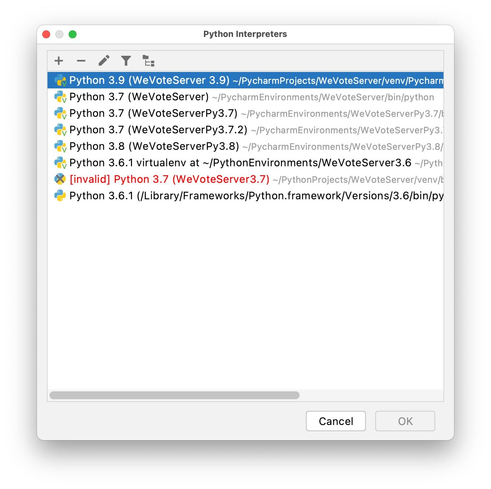
       </div>
    1) Open a **new** terminal window in the IDE, and run 'python --version' to double-check that it is using Python 3.9
    1) Close the older terminal windows, that will have confused paths to the older python versions.
*  Get the latest requirements.txt from git.
*  Install the latest setuptools
   ```
   (venv) stevepodell@Steves-MacBook-Pro-32GB-Oct-2109 WeVoteServer % pip3 install --upgrade setuptools   
   ```
*  Try to install requirements.txt in the Pycharm terminal window
    ```
    (venv) stevepodell@Steves-MacBook-Pro-32GB-Oct-2109 WeVoteServer % pip3 install -r requirements.txt
   ```
*  If the installation fails, run brew's doctor
    ```
    (venv) stevepodell@Steves-MacBook-Pro-32GB-Oct-2109 WeVoteServer % brew doctor
   ```
*  brew cleanup
    ```
    (venv) stevepodell@Steves-MacBook-Pro-32GB-Oct-2109 WeVoteServer % brew cleanup
   ```
*  I had an old String.h first in the path, and causing a `fatal error: 'cstddef' file not found` error in String.h
   ```
    (venv) mv /usr/local/include/String.h /usr/local/include/String.h.saveoff
   ```
*  This final installation of requirements.txt worked
    ```
    (venv) stevepodell@Steves-MacBook-Pro-32GB-Oct-2109 WeVoteServer % pip3 install -r requirements.txt
   ```
*  If problems appear with the openid package
Look in External Libraries/site-packages and use 'pip uninstall' to remove any libraries with 'openid' in their
name, and then try 'pip3 install -r requirements.txt' to reload openid.

*  'pip3 install -r requirements.txt' does not reload openid, try from the command line

    Try these commands, one at a time, in this order:
    ```
    pip install -e git+git://GitHub.com/necaris/python3-openid.git@master#egg=openid
    pip install -e git+git://GitHub.com/necaris/python3-openid.git@master#egg=python3-openid
    ```